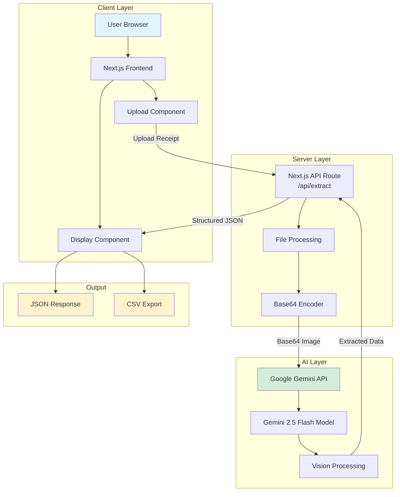
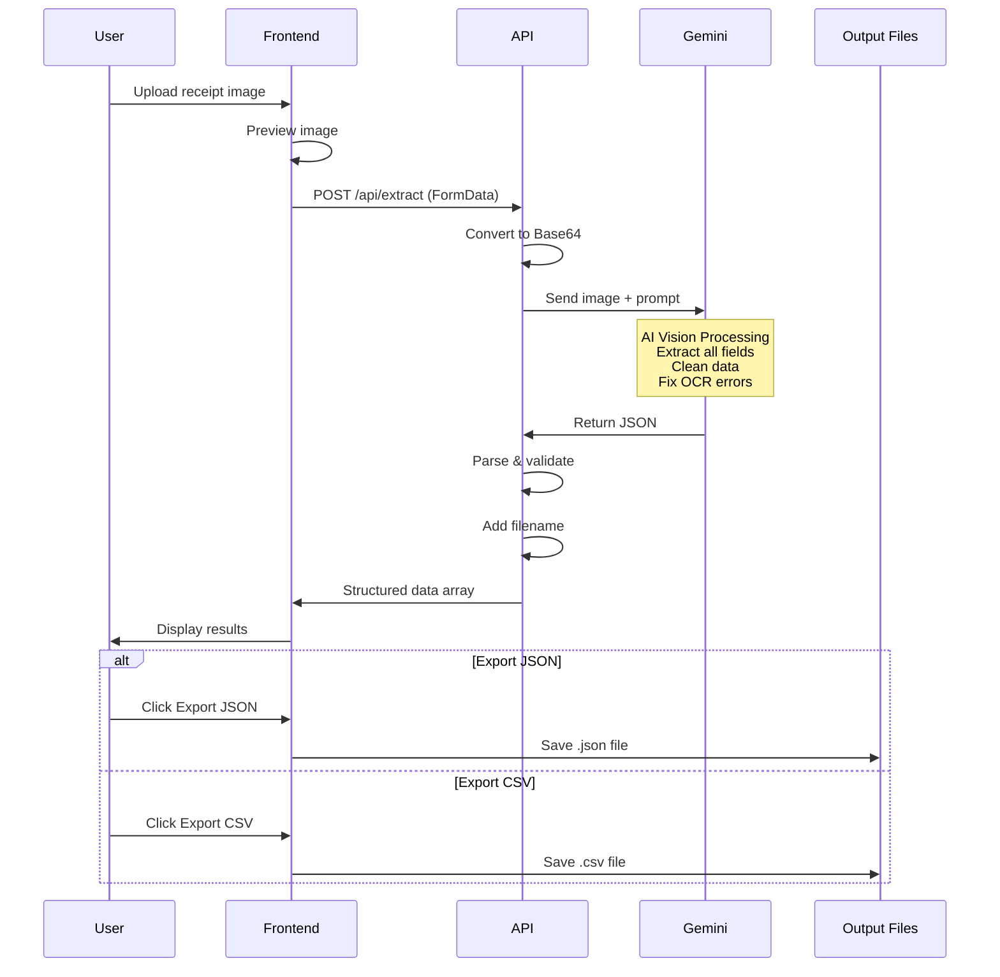
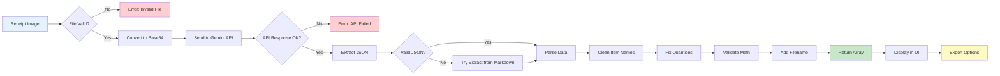
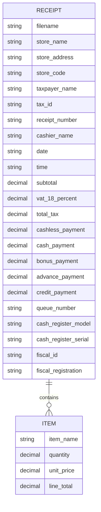
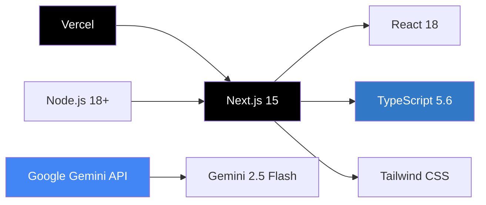

# Receipt Extractor 🧾

A powerful Next.js application that extracts structured data from Azerbaijani receipt images using Google Gemini AI (100% FREE!).


## 📸 Screenshots

### Upload Interface

*Drag and drop or browse to upload receipt images*

### Processing & Results

*AI processing and data extraction in progress*

### Detailed Receipt Data

*Comprehensive receipt data with store info, items, and payment details*

### Export & System Information

*System information and export to JSON or CSV formats*

## ✨ Features

- 📤 **Upload receipt images** via drag-and-drop or file browser
- 🤖 **AI-powered extraction** using Google Gemini 2.5 Flash
- 🇦🇿 **Azerbaijani receipt support** with full field extraction:
  - Store information (name, address, code, taxpayer, tax ID)
  - Receipt details (number, date, time, cashier, queue)
  - Itemized list with quantities, unit prices, and totals
  - Payment breakdown (cashless, cash, bonus, advance, credit)
  - Tax information (subtotal, VAT 18%, total tax)
  - System info (register model/serial, fiscal ID/registration)
  - Refund details (if applicable)
- 🧹 **Automatic data cleaning** (removes ƏDV codes, fixes OCR errors)
- 💾 **Export options** (JSON & CSV formats)
- 🌓 **Dark mode support**
- 📱 **Responsive design** for all devices
- ⚡ **Built with Next.js 15, TypeScript, and Tailwind CSS**

## Getting Started

### Prerequisites

- Node.js 18+ installed
- A FREE Google Gemini API key (get one at [Google AI Studio](https://aistudio.google.com/app/apikey))

### Installation

1. Clone the repository:
```bash
git clone <your-repo-url>
cd receipt_extractor
```

2. Install dependencies:
```bash
npm install
```

3. Create a `.env.local` file in the root directory:
```bash
cp .env.example .env.local
```

4. Add your FREE Google Gemini API key to `.env.local`:
```
GEMINI_API_KEY=your_actual_api_key_here
```

### Running Locally

Start the development server:
```bash
npm run dev
```

Open [http://localhost:3000](http://localhost:3000) in your browser.

### Building for Production

```bash
npm run build
npm start
```

## Deploying to Vercel

### Option 1: Deploy via Vercel CLI

1. Install Vercel CLI:
```bash
npm i -g vercel
```

2. Deploy:
```bash
vercel
```

3. Add your environment variable in the Vercel dashboard:
   - Go to your project settings
   - Navigate to "Environment Variables"
   - Add `GEMINI_API_KEY` with your API key

### Option 2: Deploy via Vercel Dashboard

1. Push your code to GitHub
2. Go to [vercel.com](https://vercel.com)
3. Click "New Project"
4. Import your GitHub repository
5. Add environment variable:
   - Name: `GEMINI_API_KEY`
   - Value: Your FREE Google Gemini API key
6. Click "Deploy"

## 🏗️ System Architecture



## 🔄 Data Flow



## ⚙️ Receipt Processing Pipeline



## 📊 Data Structure



## 🚀 How It Works

1. **📤 Image Upload**: User uploads a receipt image through drag-and-drop or file browser
2. **🔄 Base64 Encoding**: Image is converted to base64 format for API transmission
3. **🤖 AI Processing**: Image sent to Google Gemini 2.5 Flash vision model (FREE!)
4. **🧠 Smart Extraction**: AI extracts all fields with automatic data cleaning:
   - Removes ƏDV codes and prefixes from item names
   - Fixes OCR errors (1000→1.00, 2000→2.00)
   - Validates math (line_total = quantity × unit_price)
5. **📋 Structured Output**: Returns JSON array with one object per item
6. **🖥️ Display Results**: Formatted view with organized sections
7. **💾 Export Options**: Download as JSON or CSV

## 📡 API Endpoints

### POST `/api/extract`

Extracts data from an Azerbaijani receipt image.

**Request:**
```http
POST /api/extract
Content-Type: multipart/form-data

file: <receipt-image.jpg>
```

**Response:**
Returns a JSON array with one object per receipt item:

```json
[
  {
    "filename": "receipt-2206.jpg",
    "store_name": "GRAND MARKET",
    "store_address": "AZ1149 BAKI ŞƏHƏRI XƏTAI RAYONU ƏHMƏD...",
    "store_code": "1401395111-20002",
    "taxpayer_name": "GRAND-MART MƏHDUD MƏSULİYYƏTLİ CƏMİYYƏTİ",
    "tax_id": "1401395111",
    "receipt_number": "2206",
    "cashier_name": "Shabizada Elmin",
    "date": "15.01.2024",
    "time": "18:50:38",
    "item_name": "AZCAKE TENDİR QUTAB ET",
    "quantity": "2.00",
    "unit_price": "1.10",
    "line_total": "2.20",
    "subtotal": "7.05",
    "vat_18_percent": "0.92",
    "total_tax": "0.92",
    "cashless_payment": "0.00",
    "cash_payment": "7.05",
    "bonus_payment": "0.00",
    "advance_payment": "0.00",
    "credit_payment": "0.00",
    "queue_number": "16",
    "cash_register_model": "NCR RealPOS XR7 (7703) KLR H-POS 1.05.90",
    "cash_register_serial": "0000023239",
    "fiscal_id": "2Lg8g12Erwk5",
    "fiscal_registration": "0000162588"
  },
  // ... more items
]
```

## 🛠️ Technology Stack



### Core Technologies

| Category | Technology | Version | Purpose |
|----------|-----------|---------|---------|
| **Framework** | Next.js | 15.x | Full-stack React framework with App Router |
| **Language** | TypeScript | 5.6.x | Type-safe development |
| **Styling** | Tailwind CSS | 3.4.x | Utility-first CSS framework |
| **AI/OCR** | Google Gemini | 2.5 Flash | Vision AI for receipt extraction |
| **Deployment** | Vercel | - | Serverless hosting platform |
| **Runtime** | Node.js | 18+ | JavaScript runtime |

### Key Libraries

- `@google/generative-ai` - Google Gemini SDK
- `react` & `react-dom` - UI framework
- `next` - React framework with SSR/SSG
- `tailwindcss` - CSS framework
- `typescript` - Type system

## 💰 Why Google Gemini?

| Feature | Details |
|---------|---------|
| 💵 **100% FREE** | Generous free tier with 1,500 requests/day |
| 💳 **No Credit Card** | Get started immediately without payment |
| 🎯 **High Quality** | Advanced vision AI for accurate extraction |
| ⚡ **Fast** | Optimized for quick responses (< 3s average) |
| 🏢 **Reliable** | Backed by Google's infrastructure |
| 🌍 **Global** | Available worldwide with low latency |

## 📁 Project Structure

```
receipt_extractor/
├── src/
│   ├── app/
│   │   ├── api/
│   │   │   └── extract/
│   │   │       └── route.ts          # API endpoint for receipt extraction
│   │   ├── layout.tsx                # Root layout with metadata
│   │   ├── page.tsx                  # Main page with upload UI
│   │   ├── globals.css               # Global styles
│   │   └── icon.svg                  # App favicon
│   └── components/
│       ├── ReceiptUploader.tsx       # Upload component with drag-and-drop
│       └── ReceiptDisplay.tsx        # Results display component
├── public/                            # Static files
├── screenshots/                       # App screenshots
├── .env.local                        # Environment variables (not in git)
├── .env.example                      # Environment variables template
├── next.config.js                    # Next.js configuration
├── tailwind.config.ts                # Tailwind configuration
├── tsconfig.json                     # TypeScript configuration
├── package.json                      # Dependencies
└── README.md                         # This file
```

## 🤝 Contributing

Contributions are welcome! Here's how you can help:

1. **Fork the repository**
2. **Create a feature branch**
   ```bash
   git checkout -b feature/amazing-feature
   ```
3. **Commit your changes**
   ```bash
   git commit -m 'Add some amazing feature'
   ```
4. **Push to the branch**
   ```bash
   git push origin feature/amazing-feature
   ```
5. **Open a Pull Request**

### Development Guidelines

- Follow TypeScript best practices
- Use Tailwind CSS for styling
- Write meaningful commit messages
- Test thoroughly before submitting PR
- Update documentation as needed

## 🐛 Known Issues & Limitations

- Maximum image size: 10MB
- Supported formats: PNG, JPG, JPEG, WebP
- Best results with clear, high-resolution images
- Gemini API free tier: 1,500 requests/day

## 🔮 Future Enhancements

- [ ] Batch processing for multiple receipts
- [ ] Database integration for receipt history
- [ ] Advanced analytics and reporting
- [ ] Mobile app (React Native)
- [ ] Support for other countries' receipt formats
- [ ] Real-time receipt scanning via camera
- [ ] API authentication and rate limiting
- [ ] Excel export option

## 📝 License

This project is licensed under the MIT License - see the [LICENSE](LICENSE) file for details.

## 👨‍💻 Author

**Ismat Samadov**

- GitHub: [@ismatsamadov](https://github.com/ismatsamadov)

## 🙏 Acknowledgments

- Google Gemini API for free vision AI
- Next.js team for the amazing framework
- Tailwind CSS for beautiful styling
- Vercel for seamless deployment

## 📞 Support

If you have any questions or need help:

- Open an [issue](https://github.com/ismatsamadov/receipt_extractor/issues)
- Email: [your-email@example.com]

---

**Made with ❤️ using Next.js and Google Gemini AI**
